# Mededbot - Comprehensive Function Reference Manual

> **Version:** 1.0
> **Last Updated:** 2026-01-25
> **Purpose:** Complete reference for all functions, inputs, outputs, and data flows

---

## Table of Contents

1. [System Architecture Overview](#system-architecture-overview)
2. [Main Application (main.py)](#main-application-mainpy)
3. [Handlers Module](#handlers-module)
   - [session_manager.py](#session_managerpy)
   - [logic_handler.py](#logic_handlerpy)
   - [line_handler.py](#line_handlerpy)
   - [medchat_handler.py](#medchat_handlerpy)
   - [mail_handler.py](#mail_handlerpy)
4. [Routes Module](#routes-module)
   - [webhook.py](#webhookpy)
5. [Services Module](#services-module)
   - [gemini_service.py](#gemini_servicepy)
   - [prompt_config.py](#prompt_configpy)
   - [tts_service.py](#tts_servicepy)
   - [stt_service.py](#stt_servicepy)
   - [taigi_service.py](#taigi_servicepy)
6. [Models Module](#models-module)
   - [session.py](#sessionpy)
   - [email_log.py](#email_logpy)
7. [Utils Module](#utils-module)
   - [database.py](#databasepy)
   - [logging.py](#loggingpy)
   - [r2_service.py](#r2_servicepy)
   - [email_service.py](#email_servicepy)
   - [validators.py](#validatorspy)
   - [message_splitter.py](#message_splitterpy)
   - [rate_limiter.py](#rate_limiterpy)
   - [circuit_breaker.py](#circuit_breakerpy)
   - [Other Utilities](#other-utilities)
8. [Data Flow Diagrams](#data-flow-diagrams)
9. [Quick Reference Tables](#quick-reference-tables)

---

## System Architecture Overview

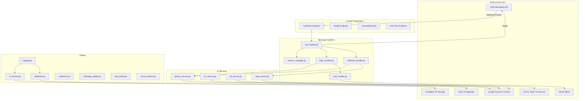

---

## Main Application (main.py)

### File Overview
The main FastAPI application entry point handling HTTP endpoints and lifecycle management.

---

### `periodic_cleanup()`

**Purpose:** Background task that runs hourly to clean up expired sessions and old TTS files.

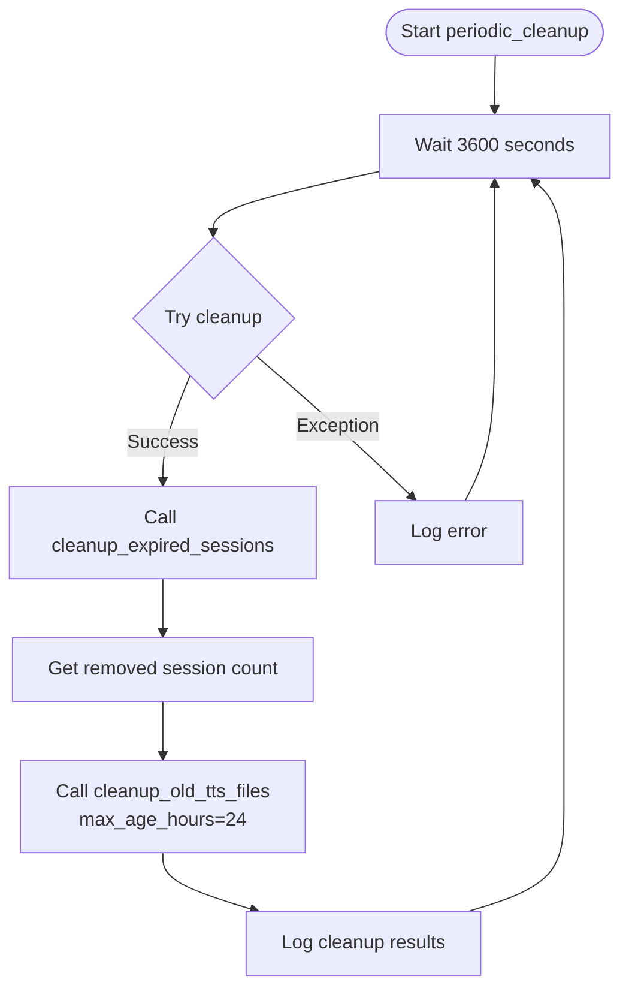

| Property | Description |
|----------|-------------|
| **Input** | None |
| **Output** | None (side effects only) |
| **Async** | Yes |
| **Runs** | Every 3600 seconds (1 hour) |
| **Side Effects** | Removes expired sessions, deletes old audio files |

---

### `lifespan(app: FastAPI)`

**Purpose:** Application lifecycle manager handling startup and shutdown events.

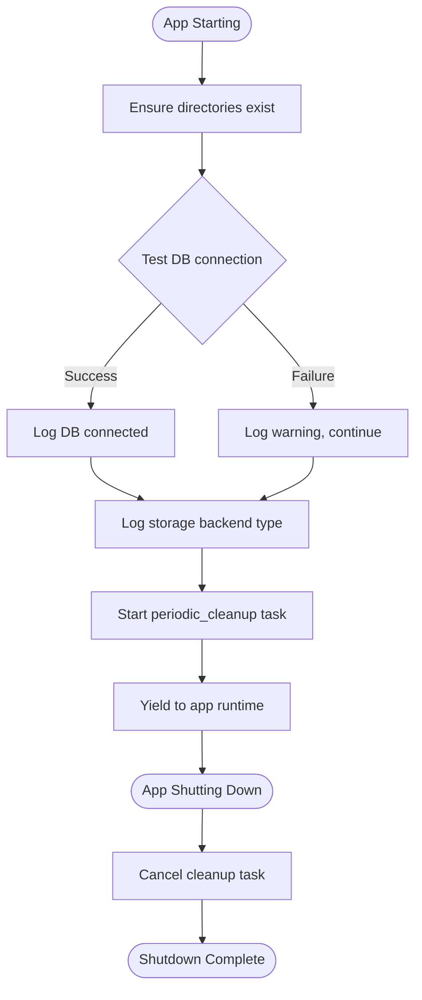

| Property | Description |
|----------|-------------|
| **Input** | `app: FastAPI` - The FastAPI application instance |
| **Output** | AsyncGenerator (context manager) |
| **Async** | Yes |
| **Purpose** | Initialize resources on startup, cleanup on shutdown |

---

### `chat(input: UserInput)`

**Purpose:** Test endpoint for chat functionality (POST /chat).

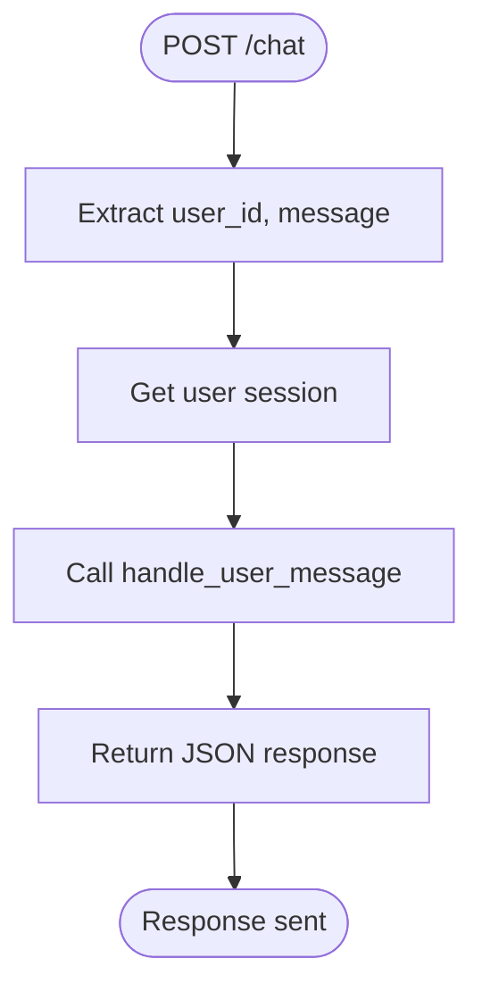

| Property | Description |
|----------|-------------|
| **Endpoint** | `POST /chat` |
| **Input** | `UserInput` model with `user_id: str`, `message: str` |
| **Output** | `{"reply": str, "gemini_called": bool}` |
| **Format** | JSON |

**Input Format:**
```json
{
  "user_id": "U1234567890abcdef...",
  "message": "糖尿病衛教"
}
```

**Output Format:**
```json
{
  "reply": "糖尿病健康教育\n\n...",
  "gemini_called": true
}
```

---

### `root()`

**Purpose:** Service information endpoint (GET /).

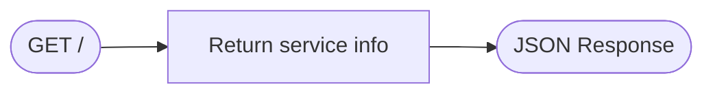

| Property | Description |
|----------|-------------|
| **Endpoint** | `GET /` |
| **Input** | None |
| **Output** | `{"service": "Mededbot", "status": "online"}` |

---

### `health()`

**Purpose:** Health check endpoint with database connectivity test.

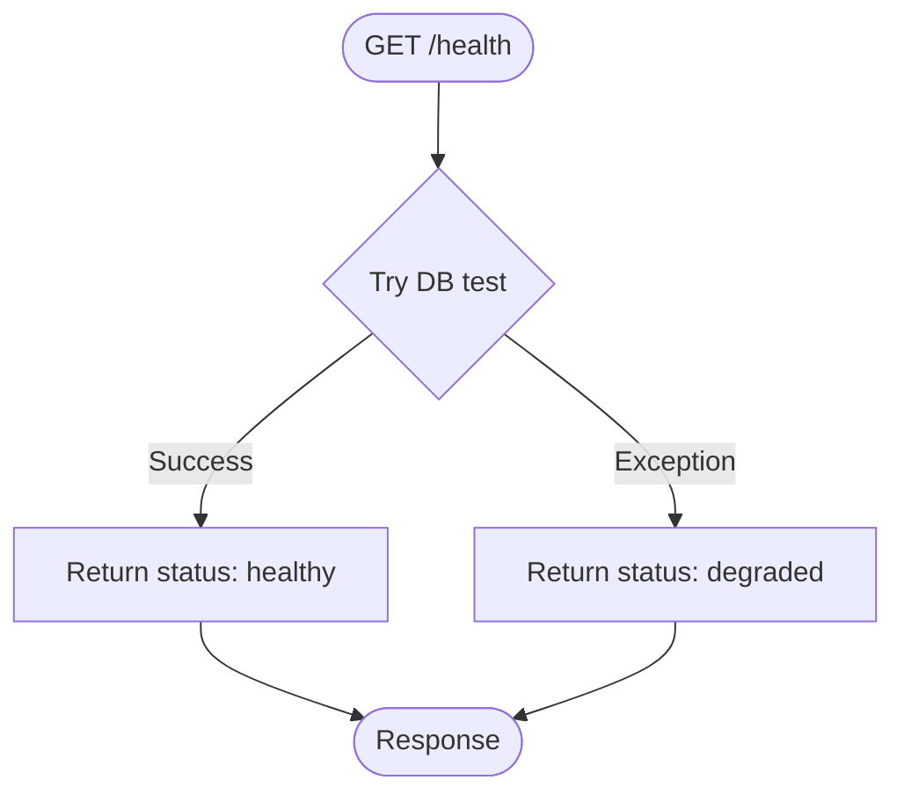

| Property | Description |
|----------|-------------|
| **Endpoint** | `GET /health` |
| **Input** | None |
| **Output** | `{"status": "healthy"/"degraded", "database": "connected"/"error"}` |
| **Async** | Yes |

---

### `ping()`

**Purpose:** Simple ping endpoint for uptime monitoring.

| Property | Description |
|----------|-------------|
| **Endpoint** | `GET /ping`, `HEAD /ping` |
| **Input** | None |
| **Output** | `"pong"` |

---

### `get_audio(filename: str)`

**Purpose:** Serve audio files from memory storage.

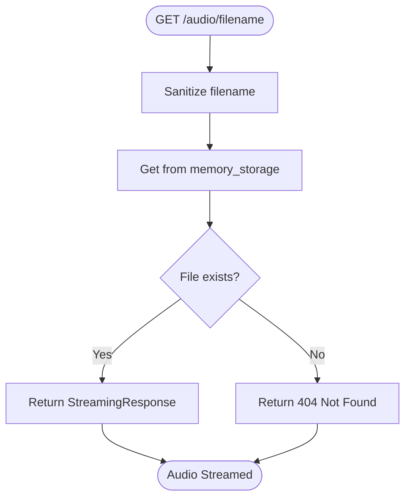

| Property | Description |
|----------|-------------|
| **Endpoint** | `GET /audio/{filename}` |
| **Input** | `filename: str` - Audio file name |
| **Output** | Audio bytes with appropriate Content-Type |
| **Error** | 404 if file not found |

---

## Handlers Module

### session_manager.py

Provides thread-safe user session management with automatic expiration.

---

#### `get_user_session(user_id: str) -> Dict`

**Purpose:** Get or create a user session with thread safety.

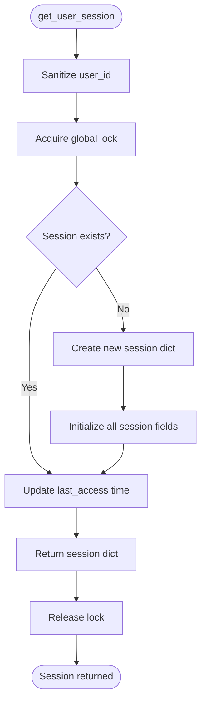

| Property | Description |
|----------|-------------|
| **Input** | `user_id: str` - LINE user ID (U + 32 hex chars) |
| **Output** | `Dict` - Session dictionary with all fields |
| **Thread-Safe** | Yes (uses RLock) |

**Session Fields Initialized:**
```python
{
    "started": False,
    "mode": None,              # "edu" or "chat"
    "prev_mode": None,
    "zh_output": None,         # Chinese content
    "translated_output": None,  # Translated content
    "translated": False,
    "awaiting_translate_language": False,
    "awaiting_email": False,
    "awaiting_modify": False,
    "last_topic": None,
    "last_translation_lang": None,
    "references": None,
    "awaiting_chat_language": False,
    "chat_target_lang": None,
    "awaiting_stt_translation": False,
    "stt_transcription": None,
    "stt_last_translation": None,
    "tts_audio_url": None,
    "tts_audio_dur": 0,
    "tts_queue": []
}
```

---

#### `get_session_lock(user_id: str) -> threading.RLock`

**Purpose:** Get a per-user reentrant lock for thread-safe operations.

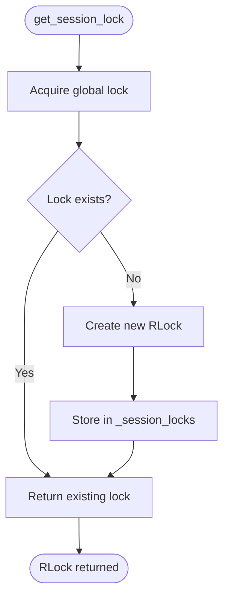

| Property | Description |
|----------|-------------|
| **Input** | `user_id: str` |
| **Output** | `threading.RLock` |
| **Purpose** | Allows nested locking for same user |

---

#### `reset_user_session(user_id: str) -> None`

**Purpose:** Clear session to initial state while preserving session object.

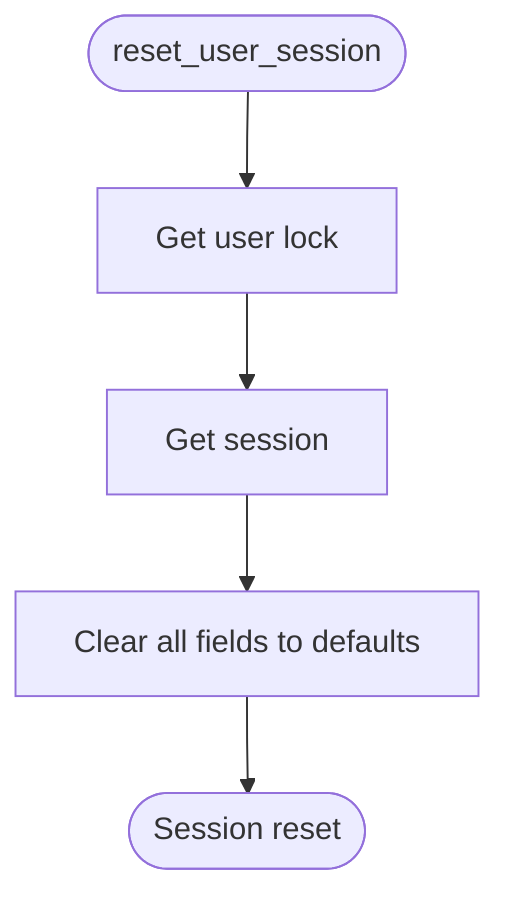

| Property | Description |
|----------|-------------|
| **Input** | `user_id: str` |
| **Output** | None |
| **Side Effect** | Resets all session fields to initial values |

---

#### `cleanup_expired_sessions() -> int`

**Purpose:** Remove sessions older than 24 hours.

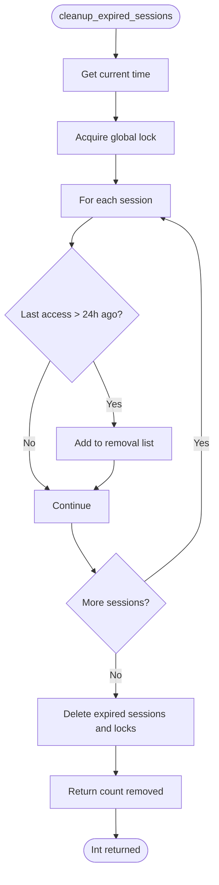

| Property | Description |
|----------|-------------|
| **Input** | None |
| **Output** | `int` - Number of sessions removed |
| **Constants** | `SESSION_EXPIRY_HOURS = 24` |

---

#### `get_session_count() -> int`

**Purpose:** Get current number of active sessions.

| Property | Description |
|----------|-------------|
| **Input** | None |
| **Output** | `int` - Active session count |
| **Thread-Safe** | Yes |

---

### logic_handler.py

Main message routing and processing logic for all user interactions.

---

#### `handle_user_message(user_id, text, session) -> Tuple[str, bool, Optional[Dict]]`

**Purpose:** Main message dispatcher that routes user input to appropriate handlers.

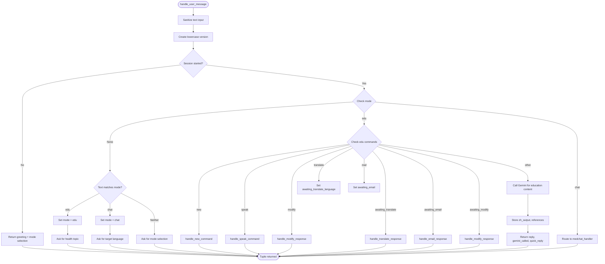

| Property | Description |
|----------|-------------|
| **Input** | `user_id: str`, `text: str`, `session: Dict` |
| **Output** | `Tuple[str, bool, Optional[Dict]]` |
| **Return Values** | `(reply_text, gemini_called, quick_reply_data)` |

**Output Format:**
```python
(
    "衛教內容...",           # Reply text
    True,                   # Whether Gemini was called
    {                       # Quick reply data (optional)
        "type": "quickReply",
        "items": [...]
    }
)
```

---

#### `handle_new_command(session) -> Tuple[str, bool, Optional[Dict]]`

**Purpose:** Reset session and start new conversation.

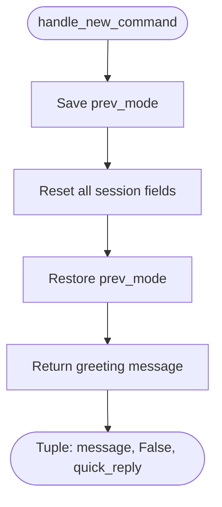

| Property | Description |
|----------|-------------|
| **Input** | `session: Dict` |
| **Output** | `Tuple[str, bool, Dict]` - (greeting, False, mode_selection_reply) |

---

#### `handle_speak_command(session, user_id) -> Tuple[str, bool, Optional[Dict]]`

**Purpose:** Generate TTS audio for the last content.

```mermaid
flowchart TD
    START([handle_speak_command]) --> CHECK{Has content?}
    CHECK -->|No| ERROR[Return "no content" message]

    CHECK -->|Yes| LANG{Check language}
    LANG -->|Taiwanese| TAIGI[Call synthesize_taigi]
    LANG -->|Other| TTS[Call tts_service.synthesize]

    TAIGI --> STORE[Store audio URL and duration in session]
    TTS --> STORE

    STORE --> CREDIT{Is Taiwanese?}
    CREDIT -->|Yes| ADD_CREDIT[Set show_taigi_credit flag]
    CREDIT -->|No| SKIP_CREDIT[Continue]

    ADD_CREDIT --> RETURN[Return audio message]
    SKIP_CREDIT --> RETURN

    ERROR --> END([Tuple returned])
    RETURN --> END
```

| Property | Description |
|----------|-------------|
| **Input** | `session: Dict`, `user_id: str` |
| **Output** | `Tuple[str, bool, Dict]` |
| **Dependencies** | `tts_service`, `taigi_service` |

---

#### `handle_modify_response(session, instruction) -> Tuple[str, bool, Optional[Dict]]`

**Purpose:** Modify existing content via Gemini based on user instruction.

```mermaid
flowchart TD
    START([handle_modify_response]) --> CHECK{Has zh_output?}
    CHECK -->|No| ERROR[Return "no content" error]

    CHECK -->|Yes| BUILD[Build modification prompt]
    BUILD --> CALL[Call Gemini with modify_prompt]
    CALL --> UPDATE[Update zh_output in session]
    UPDATE --> REFS[Get new references]
    REFS --> RETURN[Return modified content]

    ERROR --> END([Tuple returned])
    RETURN --> END
```

| Property | Description |
|----------|-------------|
| **Input** | `session: Dict`, `instruction: str` |
| **Output** | `Tuple[str, bool, Dict]` |
| **Gemini Called** | Yes |

---

#### `handle_translate_response(session, language, user_id) -> Tuple[str, bool, Optional[Dict]]`

**Purpose:** Translate Chinese content to target language.

```mermaid
flowchart TD
    START([handle_translate_response]) --> NORMALIZE[Normalize language input]
    NORMALIZE --> CHECK{Has zh_output?}
    CHECK -->|No| ERROR[Return "no content" error]

    CHECK -->|Yes| LANG{Is Taiwanese?}
    LANG -->|Yes| TAIGI[Use taigi_service.translate_to_taigi]
    LANG -->|No| GEMINI[Call Gemini call_translate]

    TAIGI --> STORE[Store translated_output, lang]
    GEMINI --> STORE

    STORE --> RETURN[Return translated content]

    ERROR --> END([Tuple returned])
    RETURN --> END
```

| Property | Description |
|----------|-------------|
| **Input** | `session: Dict`, `language: str`, `user_id: str` |
| **Output** | `Tuple[str, bool, Dict]` |
| **Supports** | All common languages + Taiwanese |

---

#### `handle_email_response(session, email, user_id) -> Tuple[str, bool, Optional[Dict]]`

**Purpose:** Send content via email with MX validation.

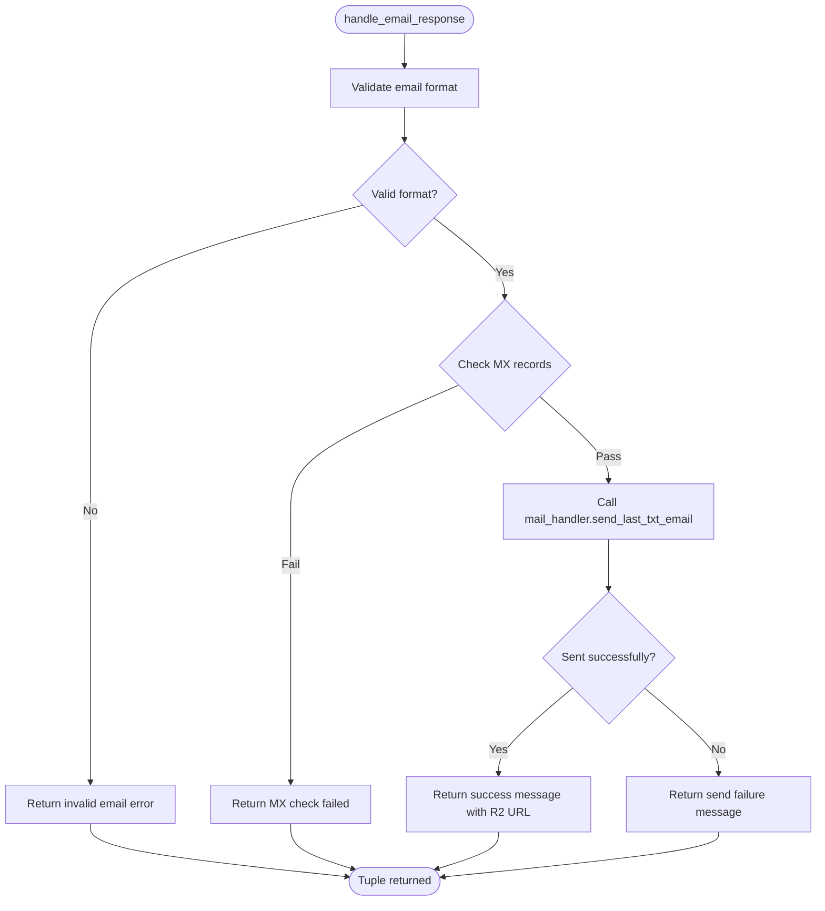

| Property | Description |
|----------|-------------|
| **Input** | `session: Dict`, `email: str`, `user_id: str` |
| **Output** | `Tuple[str, bool, Dict]` |
| **Validation** | Email format + MX record check |

---

### line_handler.py

LINE Bot specific message handling and response creation.

---

#### `handle_line_message(event: MessageEvent) -> None`

**Purpose:** Handle incoming LINE text messages.

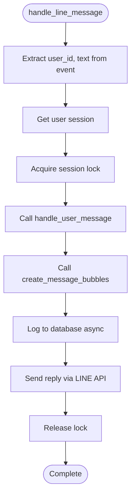

| Property | Description |
|----------|-------------|
| **Input** | `event: MessageEvent` from LINE SDK |
| **Output** | None (sends reply via LINE API) |
| **Async** | Yes |
| **Side Effects** | Logs to DB, sends LINE message |

---

#### `handle_audio_message(event: MessageEvent) -> None`

**Purpose:** Handle incoming LINE voice messages.

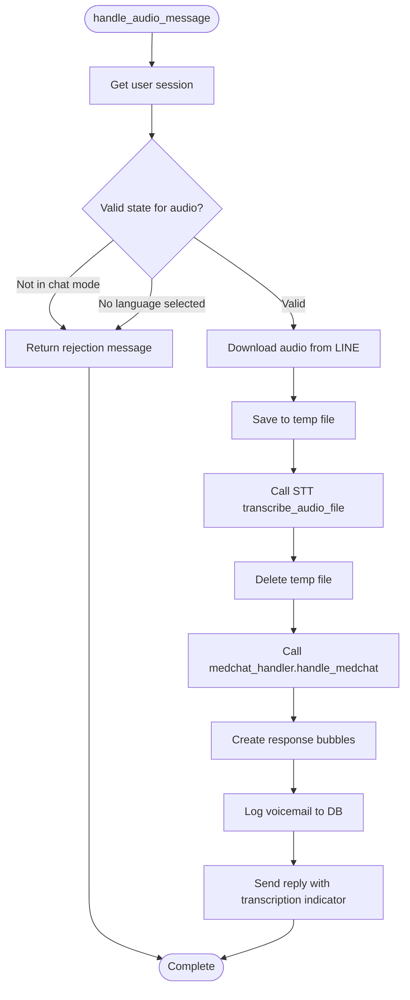

| Property | Description |
|----------|-------------|
| **Input** | `event: MessageEvent` with audio content |
| **Output** | None |
| **Max File Size** | 10MB |
| **Supported Formats** | m4a, mp3, wav, ogg |

---

#### `create_message_bubbles(session, reply_text, quick_reply_data, gemini_called) -> List`

**Purpose:** Create LINE message bubbles respecting character limits.

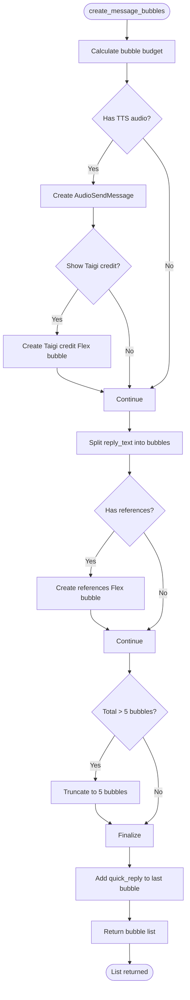

| Property | Description |
|----------|-------------|
| **Input** | `session: Dict`, `reply_text: str`, `quick_reply_data: Optional[Dict]`, `gemini_called: bool` |
| **Output** | `List[SendMessage]` - LINE message objects |
| **Limits** | Max 5 bubbles, 5000 chars total, 2000 chars per bubble |

---

#### `save_audio_file(user_id, audio_content) -> Optional[Path]`

**Purpose:** Save temporary audio file for STT processing.

```mermaid
flowchart TD
    START([save_audio_file]) --> SIZE{Size <= 10MB?}
    SIZE -->|No| REJECT[Log warning, return None]

    SIZE -->|Yes| SANITIZE[Sanitize user_id]
    SANITIZE --> PATH[Create safe file path]
    PATH --> WRITE[Write audio bytes]
    WRITE --> RETURN[Return Path object]

    REJECT --> END([Optional Path])
    RETURN --> END
```

| Property | Description |
|----------|-------------|
| **Input** | `user_id: str`, `audio_content: bytes` |
| **Output** | `Optional[Path]` - File path or None if invalid |
| **Max Size** | 10MB |

---

### medchat_handler.py

Medical chat translation handler for patient-friendly communication.

---

#### `handle_medchat(user_id, raw, session) -> Tuple[str, bool, dict]`

**Purpose:** Main medchat dispatcher handling medical text translation.

```mermaid
flowchart TD
    START([handle_medchat]) --> CHECK{Check command}

    CHECK -->|"continue translate"| CONTINUE[Continue with stored content]
    CHECK -->|awaiting_chat_language| SETLANG[Set chat_target_lang]
    CHECK -->|other| PROCESS[Process new input]

    SETLANG --> PROMPTINPUT[Prompt for medical text]

    PROCESS --> PLAINIFY[Call gemini_service.plainify]
    PLAINIFY --> STORE_ZH[Store plainified Chinese]

    STORE_ZH --> LANG{Check target language}
    LANG -->|Taiwanese| TAIGI[Call taigi_service.translate_to_taigi]
    LANG -->|Other| GEMINI[Call gemini_service.confirm_translate]

    TAIGI --> STORE_TRANS[Store translated_output]
    GEMINI --> STORE_TRANS

    STORE_TRANS --> FORMAT[Format response with both versions]
    FORMAT --> LOG[Log to database]
    LOG --> RETURN[Return formatted response]

    CONTINUE --> RETURN
    PROMPTINPUT --> END([Tuple returned])
    RETURN --> END
```

| Property | Description |
|----------|-------------|
| **Input** | `user_id: str`, `raw: str`, `session: Dict` |
| **Output** | `Tuple[str, bool, dict]` - (reply, gemini_called, quick_reply) |

**Flow:**
1. Plainify medical text → Patient-friendly Chinese
2. Translate to target language (Taiwanese uses special service)
3. Store both versions in session for TTS
4. Return formatted response

---

#### `_looks_like_language(token: str) -> bool`

**Purpose:** Heuristic to detect if a token looks like a language name.

```mermaid
flowchart TD
    START([_looks_like_language]) --> LEN{Length 1-15?}
    LEN -->|No| FALSE[Return False]
    LEN -->|Yes| CHARS{All alphabetic or CJK?}
    CHARS -->|No| FALSE
    CHARS -->|Yes| TRUE[Return True]
    FALSE --> END([bool])
    TRUE --> END
```

| Property | Description |
|----------|-------------|
| **Input** | `token: str` |
| **Output** | `bool` |
| **Valid Examples** | "English", "日文", "台語" |

---

### mail_handler.py

Email sending handler with R2 logging.

---

#### `send_last_txt_email(user_id, to_email, session) -> Tuple[bool, str]`

**Purpose:** Send health education content via email.

```mermaid
flowchart TD
    START([send_last_txt_email]) --> EXTRACT[Extract zh_output, translated_output, references]
    EXTRACT --> COMPOSE[Compose email body]
    COMPOSE --> SUBJECT[Create subject line]
    SUBJECT --> LOG[Create EmailLog object]
    LOG --> R2[Upload log to R2]
    R2 --> SEND[Send via email_service.send_email]
    SEND --> SUCCESS{Sent?}
    SUCCESS -->|Yes| RETURN_OK[Return True, r2_url]
    SUCCESS -->|No| RETURN_FAIL[Return False, r2_url]
    RETURN_OK --> END([Tuple returned])
    RETURN_FAIL --> END
```

| Property | Description |
|----------|-------------|
| **Input** | `user_id: str`, `to_email: str`, `session: Dict` |
| **Output** | `Tuple[bool, str]` - (success, r2_url) |

**Email Format:**
```
Subject: [Mededbot-多語言衛教AI] {語言} {主題} 衛教單張

[Disclaimer]

=== 中文版 ===
{zh_output}

=== {語言}版 ===
{translated_output}

=== 參考資料 ===
1. {reference_title}: {reference_url}
...
```

---

## Routes Module

### webhook.py

LINE webhook endpoint handling incoming events.

---

#### `webhook(request: Request, x_line_signature: str) -> str`

**Purpose:** Handle incoming LINE webhook events.

```mermaid
flowchart TD
    START([POST /webhook]) --> BODY[Read request body]
    BODY --> VALIDATE{Validate LINE signature}

    VALIDATE -->|Invalid| 400[Return 400 Bad Request]

    VALIDATE -->|Valid| PARSE[Parse webhook events]
    PARSE --> LOOP[For each event]

    LOOP --> TYPE{Event type?}
    TYPE -->|TextMessage| TEXT[handle_line_message]
    TYPE -->|AudioMessage| AUDIO[handle_audio_message]
    TYPE -->|Other| FALLBACK[fallback_handler]

    TEXT --> TIMEOUT{Timeout wrapper 48s}
    AUDIO --> TIMEOUT
    FALLBACK --> TIMEOUT

    TIMEOUT -->|Complete| NEXT[Next event]
    TIMEOUT -->|Timeout| LOG_TIMEOUT[Log timeout warning]
    LOG_TIMEOUT --> NEXT

    NEXT --> MORE{More events?}
    MORE -->|Yes| LOOP
    MORE -->|No| RETURN[Return "OK"]

    400 --> END([Response])
    RETURN --> END
```

| Property | Description |
|----------|-------------|
| **Endpoint** | `POST /webhook` |
| **Input** | LINE webhook event payload |
| **Output** | `"OK"` string |
| **Timeout** | 48 seconds per event |
| **Always Returns** | "OK" to prevent LINE retries |

---

## Services Module

### gemini_service.py

Google Gemini 2.5 Flash API integration for AI-powered content generation.

---

#### `_call_genai(user_text, sys_prompt, temp) -> str`

**Purpose:** Internal Gemini API call with retry logic and circuit breaker.

```mermaid
flowchart TD
    START([_call_genai]) --> CB{Circuit breaker open?}
    CB -->|Yes| ERROR[Raise CircuitBreakerError]

    CB -->|No| RETRY[Retry loop max=2]
    RETRY --> BUILD[Build request config]
    BUILD --> CALL[Call Gemini API]
    CALL --> SUCCESS{Success?}

    SUCCESS -->|Yes| EXTRACT[Extract text response]
    EXTRACT --> STORE[Store response for references]
    STORE --> CBSUCCESS[Record circuit breaker success]
    CBSUCCESS --> RETURN[Return text]

    SUCCESS -->|No| CBFAIL[Record circuit breaker failure]
    CBFAIL --> WAIT[Wait 3 seconds]
    WAIT --> AGAIN{More retries?}
    AGAIN -->|Yes| RETRY
    AGAIN -->|No| FAIL[Raise last exception]

    ERROR --> END([str or exception])
    RETURN --> END
    FAIL --> END
```

| Property | Description |
|----------|-------------|
| **Input** | `user_text: str`, `sys_prompt: str`, `temp: float` |
| **Output** | `str` - Generated text |
| **Model** | gemini-2.5-flash |
| **Timeout** | 45 seconds |
| **Max Retries** | 2 |
| **Features** | Google Search grounding enabled |

**Configuration:**
```python
{
    "model": "gemini-2.5-flash",
    "temperature": 0.25,  # or 0.2 for translation
    "max_output_tokens": 5000,
    "tools": [GoogleSearch]
}
```

---

#### `call_zh(prompt, system_prompt=zh_prompt) -> str`

**Purpose:** Generate Chinese health education content.

```mermaid
flowchart TD
    START([call_zh]) --> RATE[Check rate limit 30/min]
    RATE -->|Exceeded| REJECT[Raise RateLimitExceeded]
    RATE -->|OK| CALL[Call _call_genai with temp=0.25]
    CALL --> RETURN[Return Chinese content]
    REJECT --> END([str])
    RETURN --> END
```

| Property | Description |
|----------|-------------|
| **Input** | `prompt: str`, `system_prompt: str` (default: zh_prompt) |
| **Output** | `str` - Chinese health education content |
| **Rate Limit** | 30 requests/minute |

---

#### `call_translate(zh_text, target_lang) -> str`

**Purpose:** Translate Chinese text to target language.

```mermaid
flowchart TD
    START([call_translate]) --> BUILD[Build translate prompt with target_lang]
    BUILD --> CALL[Call _call_genai with temp=0.2]
    CALL --> RETURN[Return translated text]
    RETURN --> END([str])
```

| Property | Description |
|----------|-------------|
| **Input** | `zh_text: str`, `target_lang: str` |
| **Output** | `str` - Translated text |
| **Temperature** | 0.2 (stricter for translation accuracy) |

---

#### `plainify(text) -> str`

**Purpose:** Simplify medical text to patient-friendly Chinese.

```mermaid
flowchart TD
    START([plainify]) --> CALL[Call _call_genai with plainify_prompt]
    CALL --> RETURN[Return simplified Chinese]
    RETURN --> END([str])
```

| Property | Description |
|----------|-------------|
| **Input** | `text: str` - Medical terminology text |
| **Output** | `str` - Patient-friendly Chinese |
| **Examples** | "HTN" → "高血壓", "DM" → "糖尿病" |

---

#### `confirm_translate(plain_zh, target_lang) -> str`

**Purpose:** Translate simplified Chinese with confirmation.

| Property | Description |
|----------|-------------|
| **Input** | `plain_zh: str`, `target_lang: str` |
| **Output** | `str` - Confirmed translation |
| **Temperature** | 0.2 |

---

#### `get_references() -> List[Dict[str, str]]`

**Purpose:** Extract web references from last Gemini response.

```mermaid
flowchart TD
    START([get_references]) --> CHECK{Has _last_response?}
    CHECK -->|No| EMPTY[Return empty list]

    CHECK -->|Yes| META[Get grounding_metadata]
    META --> CHUNKS[Get grounding_chunks]
    CHUNKS --> LOOP[For each chunk]

    LOOP --> PARSE[Parse HTML for title and URL]
    PARSE --> ADD[Add to refs list]
    ADD --> MORE{More chunks?}
    MORE -->|Yes| LOOP
    MORE -->|No| RETURN[Return refs list]

    EMPTY --> END([List returned])
    RETURN --> END
```

| Property | Description |
|----------|-------------|
| **Input** | None (uses global _last_response) |
| **Output** | `List[Dict[str, str]]` - List of {title, url} |

**Output Format:**
```python
[
    {"title": "糖尿病衛教 - 衛生福利部", "url": "https://..."},
    {"title": "糖尿病飲食指南", "url": "https://..."}
]
```

---

#### `references_to_flex(refs, headline) -> Optional[Dict]`

**Purpose:** Convert references to LINE Flex Message bubble.

```mermaid
flowchart TD
    START([references_to_flex]) --> CHECK{refs empty?}
    CHECK -->|Yes| NONE[Return None]

    CHECK -->|No| BUILD[Build Flex bubble structure]
    BUILD --> HEADER[Add headline header]
    HEADER --> LOOP[For each reference]
    LOOP --> LINK[Create clickable link box]
    LINK --> MORE{More refs?}
    MORE -->|Yes| LOOP
    MORE -->|No| RETURN[Return Flex dict]

    NONE --> END([Optional Dict])
    RETURN --> END
```

| Property | Description |
|----------|-------------|
| **Input** | `refs: List[Dict]`, `headline: str` |
| **Output** | `Optional[Dict]` - LINE Flex Message structure |

---

### prompt_config.py

System prompts for Gemini AI interactions.

---

#### Prompt Constants

| Prompt | Purpose | Key Instructions |
|--------|---------|------------------|
| `zh_prompt` | Health education generation | Structured format, ~2000 tokens, middle-school level |
| `modify_prompt` | Content modification | Preserve format, allow changes |
| `translate_prompt_template` | Translation template | Preserve layout, plain text only |
| `plainify_prompt` | Medical term simplification | Expand abbreviations, patient-friendly |
| `confirm_translate_prompt` | Confirmed translation | Final translation with stamp |

**zh_prompt Structure:**
```
標題
概要
詳細說明
常見問答
建議行動
聯絡資訊
```

---

### tts_service.py

Text-to-Speech synthesis via Gemini 2.5 Flash TTS.

---

#### `synthesize(text, user_id, voice_name="Kore") -> Tuple[str, int]`

**Purpose:** Generate speech audio from text.

```mermaid
flowchart TD
    START([synthesize]) --> RATE[Check rate limit 20/min]
    RATE -->|Exceeded| REJECT[Raise RateLimitExceeded]

    RATE -->|OK| VALIDATE[Validate and truncate text to 5000 chars]
    VALIDATE --> CALL[Call gemini-2.5-flash-preview-tts]
    CALL --> AUDIO[Get audio bytes]
    AUDIO --> WAV[Convert to WAV format]

    WAV --> STORAGE{Storage backend?}
    STORAGE -->|Memory| MEM[Save to memory_storage]
    STORAGE -->|Disk| DISK[Save to tts_audio directory]

    MEM --> URL[Generate audio URL]
    DISK --> URL

    URL --> R2[Upload to R2 in background]
    R2 --> LOG[Log to database]
    LOG --> RETURN[Return URL, duration_ms]

    REJECT --> END([Tuple returned])
    RETURN --> END
```

| Property | Description |
|----------|-------------|
| **Input** | `text: str`, `user_id: str`, `voice_name: str` |
| **Output** | `Tuple[str, int]` - (audio_url, duration_ms) |
| **Rate Limit** | 20 requests/minute per user |
| **Max Text** | 5000 characters |
| **Audio Format** | WAV (mono, 24kHz, 16-bit) |

**Voice Options:**
- "Kore" (default) - Female English voice
- Other Gemini TTS voices

---

### stt_service.py

Speech-to-Text transcription via Gemini.

---

#### `transcribe_audio_file(file_path) -> str`

**Purpose:** Transcribe audio file to text.

```mermaid
flowchart TD
    START([transcribe_audio_file]) --> MIME[Detect MIME type]
    MIME --> UPLOAD{Try file upload}

    UPLOAD -->|Success| API[Call Gemini with file reference]
    UPLOAD -->|Fail| INLINE[Fallback to inline audio]

    INLINE --> API
    API --> EXTRACT[Extract transcription text]
    EXTRACT --> CLEAN[Remove filler words, correct errors]
    CLEAN --> RETURN[Return plain text]

    RETURN --> END([str])
```

| Property | Description |
|----------|-------------|
| **Input** | `file_path: Path` - Audio file path |
| **Output** | `str` - Transcribed text |
| **Supported Formats** | m4a, aac, mp3, wav, ogg, flac, aiff |

**MIME Type Mapping:**
```python
{
    ".m4a": "audio/mp4",
    ".aac": "audio/aac",
    ".mp3": "audio/mpeg",
    ".wav": "audio/wav",
    ".ogg": "audio/ogg",
    ".flac": "audio/flac",
    ".aiff": "audio/aiff"
}
```

---

### taigi_service.py

Taiwanese language support via NYCU TTS service.

---

#### `taigi_tts(mandarin, tlpa, base, gender, accent, outfile) -> bytes`

**Purpose:** Generate Taiwanese speech audio.

```mermaid
flowchart TD
    START([taigi_tts]) --> INPUT{Input type?}
    INPUT -->|mandarin| CONVERT[Convert Mandarin → TLPA]
    INPUT -->|tlpa| USE[Use TLPA directly]

    CONVERT --> SYNTH[Call synthesize_TLPA API]
    USE --> SYNTH

    SYNTH --> AUDIO[Get WAV bytes]
    AUDIO --> SAVE{outfile specified?}
    SAVE -->|Yes| WRITE[Write to file]
    SAVE -->|No| SKIP[Skip save]

    WRITE --> RETURN[Return bytes]
    SKIP --> RETURN

    RETURN --> END([bytes])
```

| Property | Description |
|----------|-------------|
| **Input** | `mandarin: str` OR `tlpa: str`, `gender: str`, `accent: str` |
| **Output** | `bytes` - WAV audio data |
| **API Base** | `http://tts001.ivoice.tw:8804/` |

**Parameters:**
- `gender`: "female" or "male"
- `accent`: "strong" (Kaohsiung) or "second" (Taipei)

---

#### `translate_to_taigi(text) -> str`

**Purpose:** Translate Chinese text to Taiwanese TLPA romanization.

```mermaid
flowchart TD
    START([translate_to_taigi]) --> RATE[Check rate limit 30/min]
    RATE -->|Exceeded| REJECT[Raise RateLimitExceeded]

    RATE -->|OK| API[Call NYCU translation API]
    API --> TLPA[Get TLPA romanization]
    TLPA --> RETURN[Return TLPA string]

    REJECT --> END([str])
    RETURN --> END
```

| Property | Description |
|----------|-------------|
| **Input** | `text: str` - Chinese text |
| **Output** | `str` - TLPA romanization |
| **Rate Limit** | 30 requests/minute |

---

#### `synthesize_taigi(text, user_id) -> Tuple[str, int]`

**Purpose:** Full Taiwanese TTS pipeline.

```mermaid
flowchart TD
    START([synthesize_taigi]) --> RATE[Check rate limit]
    RATE --> TRANSLATE[translate_to_taigi]
    TRANSLATE --> SYNTH[taigi_tts with TLPA]
    SYNTH --> SAVE[Save to memory/disk]
    SAVE --> URL[Generate audio URL]
    URL --> RETURN[Return URL, duration_ms]
    RETURN --> END([Tuple])
```

| Property | Description |
|----------|-------------|
| **Input** | `text: str`, `user_id: str` |
| **Output** | `Tuple[str, int]` - (audio_url, duration_ms) |

---

## Models Module

### session.py

Pydantic V2 session models for type-safe session management.

---

#### Class Hierarchy

```mermaid
classDiagram
    class SessionBase {
        +bool started
        +Optional~Literal~ mode
        +Optional~Literal~ prev_mode
    }

    class EducationSession {
        +Optional~str~ zh_output
        +Optional~str~ translated_output
        +bool translated
        +bool awaiting_translate_language
        +bool awaiting_email
        +bool awaiting_modify
        +Optional~str~ last_topic
        +Optional~str~ last_translation_lang
        +Optional~List~ references
    }

    class MedChatSession {
        +bool awaiting_chat_language
        +Optional~str~ chat_target_lang
    }

    class STTSession {
        +bool awaiting_stt_translation
        +Optional~str~ stt_transcription
        +Optional~str~ stt_last_translation
    }

    class TTSSession {
        +Optional~str~ tts_audio_url
        +int tts_audio_dur
        +List~str~ tts_queue
    }

    class UserSession {
        +to_legacy_dict() Dict
        +from_legacy_dict(data) UserSession
        +is_awaiting_input() bool
        +clear_awaiting_flags()
    }

    SessionBase <|-- UserSession
    EducationSession <|-- UserSession
    MedChatSession <|-- UserSession
    STTSession <|-- UserSession
    TTSSession <|-- UserSession
```

---

#### `UserSession.to_legacy_dict() -> dict`

**Purpose:** Convert Pydantic model to dictionary for backward compatibility.

| Property | Description |
|----------|-------------|
| **Input** | Self (UserSession instance) |
| **Output** | `dict` - All session fields as dictionary |

---

#### `UserSession.from_legacy_dict(data) -> UserSession`

**Purpose:** Create UserSession from dictionary.

| Property | Description |
|----------|-------------|
| **Input** | `data: dict` - Session data dictionary |
| **Output** | `UserSession` - Validated Pydantic model |
| **Class Method** | Yes |

---

#### `UserSession.is_awaiting_input() -> bool`

**Purpose:** Check if session is waiting for user input.

```mermaid
flowchart TD
    START([is_awaiting_input]) --> CHECK{Any awaiting flag True?}
    CHECK -->|awaiting_translate_language| TRUE[Return True]
    CHECK -->|awaiting_email| TRUE
    CHECK -->|awaiting_modify| TRUE
    CHECK -->|awaiting_chat_language| TRUE
    CHECK -->|awaiting_stt_translation| TRUE
    CHECK -->|None| FALSE[Return False]
    TRUE --> END([bool])
    FALSE --> END
```

---

### email_log.py

Email logging model for R2 storage.

---

#### `EmailLog.create(...) -> EmailLog`

**Purpose:** Factory method to create email log with extracted metadata.

```mermaid
flowchart TD
    START([EmailLog.create]) --> TIMESTAMP[Generate timestamp]
    TIMESTAMP --> EXTRACT[Extract lengths and counts]
    EXTRACT --> BUILD[Build EmailLog dataclass]
    BUILD --> RETURN[Return EmailLog]
    RETURN --> END([EmailLog])
```

| Property | Description |
|----------|-------------|
| **Input** | `user_id`, `to_email`, `subject`, `content`, `topic`, `zh`, `translated`, `lang`, `refs` |
| **Output** | `EmailLog` dataclass instance |

---

#### `EmailLog.to_text() -> str`

**Purpose:** Format email log as text for R2 upload.

**Output Format:**
```
=== EMAIL LOG ===
Timestamp: 20260125_143022
User ID: U1234...
Recipient: user@example.com
Subject: [Mededbot] 糖尿病...
Topic: 糖尿病

=== METADATA ===
Original Length: 2500
Translated Length: 2800
References Count: 3
Language: 英文

=== CONTENT ===
...
```

---

## Utils Module

### database.py

PostgreSQL database operations with async and sync support.

---

#### Database Models

```mermaid
erDiagram
    ChatLog {
        int id PK
        datetime timestamp
        string user_id
        text message
        text reply
        string action_type
        boolean gemini_call
        string gemini_output_url
        datetime created_at
    }

    TTSLog {
        int id PK
        datetime timestamp
        string user_id
        text text
        string audio_filename
        string audio_url
        string drive_link
        string status
        datetime created_at
    }

    VoicemailLog {
        int id PK
        datetime timestamp
        string user_id
        string audio_filename
        text transcription
        text translation
        string drive_link
        datetime created_at
    }
```

---

#### `get_async_db_engine() -> AsyncEngine`

**Purpose:** Get async SQLAlchemy engine for PostgreSQL.

```mermaid
flowchart TD
    START([get_async_db_engine]) --> CHECK{Engine exists?}
    CHECK -->|Yes| RETURN[Return existing engine]
    CHECK -->|No| CREATE[Create AsyncEngine]
    CREATE --> CONFIG[Configure pool settings]
    CONFIG --> STORE[Store globally]
    STORE --> RETURN
    RETURN --> END([AsyncEngine])
```

| Property | Description |
|----------|-------------|
| **Output** | `AsyncEngine` - SQLAlchemy async engine |
| **Driver** | asyncpg |
| **Pool Size** | Configured for Neon DB |

---

#### `async def log_chat_to_db(...)`

**Purpose:** Log chat interaction to database asynchronously.

```mermaid
flowchart TD
    START([log_chat_to_db]) --> VALIDATE[Validate/sanitize inputs]
    VALIDATE --> SESSION[Get async DB session]
    SESSION --> CREATE[Create ChatLog object]
    CREATE --> ADD[Add to session]
    ADD --> COMMIT[Commit transaction]
    COMMIT --> END([Complete])
```

| Property | Description |
|----------|-------------|
| **Input** | `user_id`, `message`, `reply`, `action_type`, `gemini_call`, `gemini_output_url` |
| **Output** | None |
| **Async** | Yes |

---

### logging.py

Async logging to database and R2 storage.

---

#### `log_chat(user_id, message, reply, session, action_type, gemini_call, gemini_output_url)`

**Purpose:** Smart context-aware chat logging.

```mermaid
flowchart TD
    START([log_chat]) --> DETECT{Async context?}
    DETECT -->|Yes| TASK[Create async task]
    DETECT -->|No| THREAD[Submit to thread pool]

    TASK --> UPLOAD{Gemini output?}
    THREAD --> UPLOAD

    UPLOAD -->|Yes| R2[Upload to R2]
    UPLOAD -->|No| SKIP[Skip R2]

    R2 --> DB[Log to database]
    SKIP --> DB

    DB --> END([Complete])
```

| Property | Description |
|----------|-------------|
| **Input** | All chat log fields + session dict |
| **Output** | None (fire-and-forget) |
| **Context-Aware** | Detects async/sync automatically |

---

#### `log_tts_async(user_id, text, audio_path, audio_url)`

**Purpose:** Async TTS logging with R2 upload.

```mermaid
flowchart TD
    START([log_tts_async]) --> UPLOAD[Upload audio to R2]
    UPLOAD --> RETRY{Success?}
    RETRY -->|Fail| BACKOFF[Exponential backoff]
    BACKOFF --> RETRY
    RETRY -->|Success after 3| LOG[Log to database]
    RETRY -->|All failed| ERROR[Log error]
    LOG --> CLEANUP{Memory storage?}
    CLEANUP -->|Yes| DELETE[Delete local copy]
    CLEANUP -->|No| KEEP[Keep file]
    DELETE --> END([Complete])
    KEEP --> END
    ERROR --> END
```

| Property | Description |
|----------|-------------|
| **Input** | `user_id`, `text`, `audio_path`, `audio_url` |
| **Output** | None |
| **Retries** | 3 with exponential backoff |

---

### r2_service.py

Cloudflare R2 storage integration.

---

#### Class: `R2Service`

```mermaid
classDiagram
    class R2Service {
        -client: boto3.client
        -bucket_name: str
        -public_url: str
        +upload_file(file_data, key, content_type) Dict
        +upload_text_file(content, filename, folder) Dict
        +upload_audio_file(audio_data, filename, folder) Dict
        +upload_gemini_output(content, user_id, session) Tuple
        +get_content_type(filename) str
    }
```

---

#### `R2Service.upload_file(file_data, key, content_type) -> Dict[str, str]`

**Purpose:** Upload file to R2 storage.

```mermaid
flowchart TD
    START([upload_file]) --> PUT[put_object to R2]
    PUT --> URL[Generate public URL]
    URL --> RETURN[Return id, webViewLink]
    RETURN --> END([Dict])
```

| Property | Description |
|----------|-------------|
| **Input** | `file_data: bytes`, `key: str`, `content_type: str` |
| **Output** | `Dict[str, str]` - {id, webViewLink} |
| **Public URL** | https://galenchen.uk/{key} |

---

#### `R2Service.upload_gemini_output(content, user_id, session_data) -> Tuple[str, str]`

**Purpose:** Upload formatted Gemini output with metadata.

```mermaid
flowchart TD
    START([upload_gemini_output]) --> FORMAT[Format content with metadata]
    FORMAT --> TIMESTAMP[Generate timestamp filename]
    TIMESTAMP --> UPLOAD[upload_text_file to gemini-outputs/]
    UPLOAD --> RETURN[Return webViewLink, id]
    RETURN --> END([Tuple])
```

| Property | Description |
|----------|-------------|
| **Input** | `content: str`, `user_id: str`, `session_data: Dict` |
| **Output** | `Tuple[str, str]` - (webViewLink, id) |
| **Folder** | gemini-outputs/ |

---

### email_service.py

Gmail SMTP email sending.

---

#### `send_email(to_email, subject, body) -> bool`

**Purpose:** Send email via Gmail SMTP.

```mermaid
flowchart TD
    START([send_email]) --> VALIDATE[Validate inputs]
    VALIDATE --> COMPOSE[Compose email message]
    COMPOSE --> DISCLAIMER[Append legal disclaimer]
    DISCLAIMER --> CONNECT[Connect to Gmail SMTP SSL]
    CONNECT --> AUTH[Authenticate with app password]
    AUTH --> SEND[Send email]
    SEND --> SUCCESS{Sent?}
    SUCCESS -->|Yes| TRUE[Return True]
    SUCCESS -->|No| FALSE[Return False]
    TRUE --> END([bool])
    FALSE --> END
```

| Property | Description |
|----------|-------------|
| **Input** | `to_email: str`, `subject: str`, `body: str` |
| **Output** | `bool` - Success status |
| **Port** | 465 (SSL) |

**Disclaimer Added:**
```
[AI生成內容聲明]
此衛教單張由AI生成，僅供參考，不構成正式醫療建議...
```

---

### validators.py

Input validation and sanitization utilities.

---

#### Validation Functions

```mermaid
flowchart TD
    subgraph Validators
        A[sanitize_user_id] --> A1{Valid LINE ID?}
        A1 -->|U + 32 hex| PASS1[Return sanitized]
        A1 -->|Invalid| FAIL1[Raise ValueError]

        B[sanitize_filename] --> B1[Remove path traversal]
        B1 --> B2[Remove dangerous chars]
        B2 --> B3[Limit length to 255]

        C[validate_email] --> C1{RFC 5322 format?}
        C1 -->|Valid| PASS3[Return lowercase]
        C1 -->|Invalid| FAIL3[Raise ValueError]

        D[sanitize_text] --> D1[Remove null bytes]
        D1 --> D2[Remove control chars]
        D2 --> D3[Limit to max_length]

        E[create_safe_path] --> E1[Join base + filename]
        E1 --> E2{Inside base_dir?}
        E2 -->|Yes| PASS5[Return path]
        E2 -->|No| FAIL5[Raise ValueError]
    end
```

| Function | Input | Output | Validation |
|----------|-------|--------|------------|
| `sanitize_user_id(user_id)` | str | str | LINE ID format (U + 32 hex) |
| `sanitize_filename(filename)` | str | str | No path traversal, safe chars |
| `validate_email(email)` | str | str | RFC 5322 simplified |
| `sanitize_text(text, max_length)` | str, int | str | No nulls, length limit |
| `validate_language_code(lang_code)` | str | str | CJK or English format |
| `validate_audio_filename(filename)` | str | str | Safe + valid extension |
| `validate_action_type(action_type)` | str | Optional[str] | Known action or 'other' |
| `create_safe_path(base_dir, filename)` | str, str | str | Prevents directory traversal |

---

### message_splitter.py

LINE message length handling.

---

#### `split_long_text(text, prefix, max_bubbles, char_budget) -> List[str]`

**Purpose:** Split text across multiple LINE bubbles.

```mermaid
flowchart TD
    START([split_long_text]) --> BUDGET[Calculate char budget]
    BUDGET --> LOOP[While text remains]

    LOOP --> FIT{Fits in one bubble?}
    FIT -->|Yes| ADD[Add to bubbles list]
    FIT -->|No| FIND[Find natural break point]

    FIND --> ORDER[Try break points in order]
    ORDER --> P1[1. Paragraph break]
    P1 --> P2[2. Sentence end]
    P2 --> P3[3. Line break]
    P3 --> P4[4. Comma]
    P4 --> P5[5. Space]
    P5 --> P6[6. Hard cut]

    P6 --> SPLIT[Split at break point]
    SPLIT --> ADD

    ADD --> COUNT{Max bubbles reached?}
    COUNT -->|Yes| TRUNCATE[Add truncation notice]
    COUNT -->|No| MORE{More text?}
    MORE -->|Yes| LOOP
    MORE -->|No| RETURN[Return bubbles list]

    TRUNCATE --> RETURN
    RETURN --> END([List str])
```

| Property | Description |
|----------|-------------|
| **Input** | `text: str`, `prefix: str`, `max_bubbles: int`, `char_budget: int` |
| **Output** | `List[str]` - Text chunks for each bubble |
| **Max Per Bubble** | 1950 chars (safe limit) |
| **Break Priority** | Paragraph > Sentence > Line > Comma > Space > Hard |

---

#### `calculate_bubble_budget(has_references, has_audio, has_taigi_credit) -> int`

**Purpose:** Calculate available content bubbles based on other message components.

```mermaid
flowchart TD
    START([calculate_bubble_budget]) --> BASE[Start with 5 bubbles]
    BASE --> REF{has_references?}
    REF -->|Yes| SUB1[Subtract 1]
    REF -->|No| NEXT1[Continue]
    SUB1 --> NEXT1
    NEXT1 --> AUDIO{has_audio?}
    AUDIO -->|Yes| SUB2[Subtract 1]
    AUDIO -->|No| NEXT2[Continue]
    SUB2 --> NEXT2
    NEXT2 --> CREDIT{has_taigi_credit?}
    CREDIT -->|Yes| SUB3[Subtract 1]
    CREDIT -->|No| NEXT3[Continue]
    SUB3 --> NEXT3
    NEXT3 --> RETURN[Return remaining 1-3]
    RETURN --> END([int])
```

| Property | Description |
|----------|-------------|
| **Input** | Three boolean flags |
| **Output** | `int` - Available content bubbles (1-3) |

---

### rate_limiter.py

Token bucket rate limiting implementation.

---

#### Class: `RateLimiter`

```mermaid
classDiagram
    class RateLimiter {
        -max_requests: int
        -window_seconds: int
        -requests: Dict~str, List~float~~
        -lock: threading.Lock
        +is_allowed(key) bool
        +reset(key) void
        +get_remaining(key) int
        +cleanup_old_entries(max_age_seconds) int
    }
```

---

#### `RateLimiter.is_allowed(key: str) -> bool`

**Purpose:** Check if request is within rate limit.

```mermaid
flowchart TD
    START([is_allowed]) --> LOCK[Acquire lock]
    LOCK --> NOW[Get current time]
    NOW --> CLEAN[Remove timestamps outside window]
    CLEAN --> COUNT{Count < max_requests?}
    COUNT -->|Yes| ADD[Add current timestamp]
    ADD --> TRUE[Return True]
    COUNT -->|No| FALSE[Return False]
    TRUE --> UNLOCK[Release lock]
    FALSE --> UNLOCK
    UNLOCK --> END([bool])
```

| Property | Description |
|----------|-------------|
| **Input** | `key: str` - Rate limit key (usually user_id) |
| **Output** | `bool` - True if allowed |
| **Thread-Safe** | Yes |

---

#### `@rate_limit` Decorator

**Purpose:** Apply rate limiting to functions.

```python
@rate_limit(limiter=gemini_limiter, key_func=lambda user_id, *args: user_id)
def call_zh(user_id, prompt):
    ...
```

| Property | Description |
|----------|-------------|
| **Parameters** | `limiter: RateLimiter`, `key_func: Callable` |
| **Raises** | `RateLimitExceeded` if limit hit |
| **Supports** | Both sync and async functions |

---

### circuit_breaker.py

Service resilience pattern implementation.

---

#### Class: `CircuitBreaker`

```mermaid
stateDiagram-v2
    [*] --> CLOSED
    CLOSED --> OPEN: failure_count >= threshold
    OPEN --> HALF_OPEN: recovery_timeout elapsed
    HALF_OPEN --> CLOSED: success
    HALF_OPEN --> OPEN: failure
    CLOSED --> CLOSED: success (reset counter)
```

---

#### `CircuitBreaker.call(func, *args, **kwargs) -> Any`

**Purpose:** Execute function with circuit breaker protection.

```mermaid
flowchart TD
    START([call]) --> STATE{Current state?}

    STATE -->|OPEN| TIMEOUT{Recovery time passed?}
    TIMEOUT -->|No| REJECT[Raise CircuitBreakerError]
    TIMEOUT -->|Yes| HALF[Set HALF_OPEN]

    STATE -->|CLOSED| EXEC[Execute function]
    HALF --> EXEC

    EXEC --> SUCCESS{Success?}
    SUCCESS -->|Yes| RECORD_S[Record success]
    RECORD_S --> CLOSE[Set CLOSED, reset counter]
    CLOSE --> RETURN[Return result]

    SUCCESS -->|No| RECORD_F[Record failure]
    RECORD_F --> CHECK{failure_count >= threshold?}
    CHECK -->|Yes| OPEN_CB[Set OPEN]
    CHECK -->|No| RERAISE[Re-raise exception]
    OPEN_CB --> RERAISE

    REJECT --> END([Result or exception])
    RETURN --> END
    RERAISE --> END
```

| Property | Description |
|----------|-------------|
| **Input** | `func: Callable`, `*args`, `**kwargs` |
| **Output** | Function result or raises exception |
| **States** | CLOSED, OPEN, HALF_OPEN |
| **Default Threshold** | 5 failures |
| **Default Recovery** | 60 seconds |

---

### Other Utilities

#### storage_config.py

```mermaid
flowchart TD
    START([get_storage_backend]) --> ENV{STORAGE_BACKEND env?}
    ENV -->|Set| USE_ENV[Use explicit setting]
    ENV -->|Not set| DETECT[Detect environment]

    DETECT --> CLOUD{Cloud platform?}
    CLOUD -->|RENDER/DYNO/RAILWAY| MEMORY[Return MEMORY]
    CLOUD -->|No| R2{R2 configured?}
    R2 -->|Yes| R2_STORAGE[Return R2]
    R2 -->|No| LOCAL[Return LOCAL]

    USE_ENV --> END([StorageBackend])
    MEMORY --> END
    R2_STORAGE --> END
    LOCAL --> END
```

---

#### memory_storage.py

```mermaid
classDiagram
    class MemoryStorage {
        -_storage: Dict~str, Tuple~bytes, str, float~~
        -_lock: threading.Lock
        +save(filename, data, content_type) void
        +get(filename) Optional~Tuple~
        +delete(filename) void
        +clear_all() void
        +cleanup_old_files(max_age_seconds) void
    }
```

---

#### language_utils.py

**Language Normalization Map:**

| Input | Normalized Output |
|-------|-------------------|
| "taiwanese", "taigi", "hokkien" | "台語" |
| "english", "eng" | "英文" |
| "japanese", "日語" | "日文" |
| "korean", "한국어" | "韓文" |
| "thai", "ไทย" | "泰文" |
| "vietnamese", "tiếng việt" | "越南文" |
| "indonesian", "bahasa" | "印尼文" |
| "spanish", "español" | "西班牙文" |
| "french", "français" | "法文" |
| "german", "deutsch" | "德文" |

---

## Data Flow Diagrams

### Complete Message Processing Flow

```mermaid
sequenceDiagram
    participant User as LINE User
    participant LINE as LINE Platform
    participant WH as Webhook
    participant LH as line_handler
    participant SM as session_manager
    participant LOGIC as logic_handler
    participant GS as gemini_service
    participant TTS as tts_service
    participant DB as database
    participant R2 as R2 Storage

    User->>LINE: Send message
    LINE->>WH: POST /webhook
    WH->>LH: handle_line_message(event)
    LH->>SM: get_user_session(user_id)
    SM-->>LH: session dict
    LH->>LOGIC: handle_user_message(user_id, text, session)

    alt Education Mode - New Topic
        LOGIC->>GS: call_zh(topic)
        GS-->>LOGIC: zh_content
        LOGIC->>GS: get_references()
        GS-->>LOGIC: references list
    else Translate Command
        LOGIC->>GS: call_translate(zh_text, lang)
        GS-->>LOGIC: translated text
    else Speak Command
        LOGIC->>TTS: synthesize(text, user_id)
        TTS-->>LOGIC: (audio_url, duration)
    end

    LOGIC-->>LH: (reply, gemini_called, quick_reply)
    LH->>LH: create_message_bubbles()

    par Async Operations
        LH->>DB: log_chat_to_db()
        LH->>R2: upload_gemini_output()
    end

    LH->>LINE: reply_message(bubbles)
    LINE->>User: Display response
```

---

### Voice Message Processing Flow

```mermaid
sequenceDiagram
    participant User as LINE User
    participant LINE as LINE Platform
    participant LH as line_handler
    participant STT as stt_service
    participant MC as medchat_handler
    participant GS as gemini_service
    participant TAIGI as taigi_service

    User->>LINE: Send voice message
    LINE->>LH: handle_audio_message(event)
    LH->>LINE: Get audio content
    LINE-->>LH: audio bytes
    LH->>LH: save_audio_file()
    LH->>STT: transcribe_audio_file(path)
    STT->>GS: Gemini transcription
    GS-->>STT: transcribed text
    STT-->>LH: text
    LH->>LH: Delete temp file

    LH->>MC: handle_medchat(user_id, text, session)
    MC->>GS: plainify(text)
    GS-->>MC: plain Chinese

    alt Taiwanese Target
        MC->>TAIGI: translate_to_taigi(text)
        TAIGI-->>MC: TLPA romanization
    else Other Language
        MC->>GS: confirm_translate(zh, lang)
        GS-->>MC: translated text
    end

    MC-->>LH: (reply, gemini_called, quick_reply)
    LH->>LINE: Reply with transcription indicator
```

---

### TTS Audio Generation Flow

```mermaid
sequenceDiagram
    participant LOGIC as logic_handler
    participant TTS as tts_service
    participant TAIGI as taigi_service
    participant GEMINI as Gemini TTS
    participant NYCU as NYCU Taigi API
    participant MEM as memory_storage
    participant R2 as R2 Storage
    participant DB as database

    alt Standard TTS
        LOGIC->>TTS: synthesize(text, user_id)
        TTS->>GEMINI: Generate speech
        GEMINI-->>TTS: PCM audio bytes
        TTS->>TTS: Convert to WAV
    else Taiwanese TTS
        LOGIC->>TAIGI: synthesize_taigi(text, user_id)
        TAIGI->>NYCU: Convert to TLPA
        NYCU-->>TAIGI: TLPA romanization
        TAIGI->>NYCU: Synthesize TLPA
        NYCU-->>TAIGI: WAV bytes
    end

    alt Memory Storage
        TTS->>MEM: save(filename, data)
        MEM-->>TTS: stored
    else Disk Storage
        TTS->>TTS: Write to tts_audio/
    end

    par Background Upload
        TTS->>R2: upload_audio_file()
        TTS->>DB: log_tts_to_db()
    end

    TTS-->>LOGIC: (audio_url, duration_ms)
```

---

## Quick Reference Tables

### Environment Variables

| Variable | Required | Description |
|----------|----------|-------------|
| `LINE_CHANNEL_ACCESS_TOKEN` | Yes | LINE Bot access token |
| `LINE_CHANNEL_SECRET` | Yes | LINE Bot channel secret |
| `GOOGLE_API_KEY` | Yes | Google Gemini API key |
| `DATABASE_URL` | Yes | PostgreSQL connection URL |
| `R2_ENDPOINT_URL` | No | Cloudflare R2 endpoint |
| `R2_ACCESS_KEY_ID` | No | R2 access key |
| `R2_SECRET_ACCESS_KEY` | No | R2 secret key |
| `R2_BUCKET_NAME` | No | R2 bucket name |
| `GMAIL_ADDRESS` | No | Gmail sender address |
| `GMAIL_APP_PASSWORD` | No | Gmail app password |
| `STORAGE_BACKEND` | No | Force storage type (LOCAL/R2/MEMORY) |

---

### Rate Limits

| Service | Limit | Window |
|---------|-------|--------|
| Gemini API | 30 requests | 60 seconds |
| TTS Service | 20 requests | 60 seconds |
| Taigi Service | 30 requests | 60 seconds |

---

### LINE Message Limits

| Limit | Value |
|-------|-------|
| Max bubbles per message | 5 |
| Max characters per bubble | 5000 |
| Safe characters per bubble | 1950 |
| Max total characters | 5000 |
| Max audio file size | 10MB |

---

### Session Timeout

| Setting | Value |
|---------|-------|
| Session expiry | 24 hours |
| Cleanup frequency | 1 hour |
| TTS file max age | 24 hours |

---

### Supported Languages

| Language | Code | Taiwanese Support |
|----------|------|-------------------|
| 英文 (English) | en | No |
| 日文 (Japanese) | ja | No |
| 韓文 (Korean) | ko | No |
| 泰文 (Thai) | th | No |
| 越南文 (Vietnamese) | vi | No |
| 印尼文 (Indonesian) | id | No |
| 台語 (Taiwanese) | - | Yes (NYCU TTS) |
| 西班牙文 (Spanish) | es | No |
| 法文 (French) | fr | No |
| 德文 (German) | de | No |

---

### Action Types for Logging

| Action Type | Description |
|-------------|-------------|
| `edu` | Education mode entry |
| `chat` | Chat mode entry |
| `translate` | Translation request |
| `tts` | Text-to-speech generation |
| `email` | Email sending |
| `modify` | Content modification |
| `new` | New conversation |
| `voice` | Voice message received |
| `other` | Unknown/other actions |

---

### Error Codes and Handling

| Error | Handler | Recovery |
|-------|---------|----------|
| `RateLimitExceeded` | rate_limiter.py | Wait and retry |
| `CircuitBreakerError` | circuit_breaker.py | Wait 60s for recovery |
| `ValueError` (validation) | validators.py | User input error message |
| Database connection | database.py | Sync fallback |
| R2 upload failure | r2_service.py | 3 retries with backoff |

---

## Debugging Guide

### Common Issues

1. **Session not persisting**
   - Check `session_manager.py` locks
   - Verify `SESSION_EXPIRY_HOURS` setting
   - Look for cleanup_expired_sessions calls

2. **TTS audio not playing**
   - Check storage backend configuration
   - Verify audio URL is accessible
   - Check memory_storage for ephemeral deployments

3. **Gemini errors**
   - Check circuit breaker state
   - Verify rate limits not exceeded
   - Check API key validity

4. **LINE message truncation**
   - Check `message_splitter.py` limits
   - Verify bubble count <= 5
   - Check character limits

5. **Email not sending**
   - Verify MX record check passing
   - Check Gmail app password
   - Verify email validation

---

*This document is auto-generated. For updates, regenerate from source code.*
